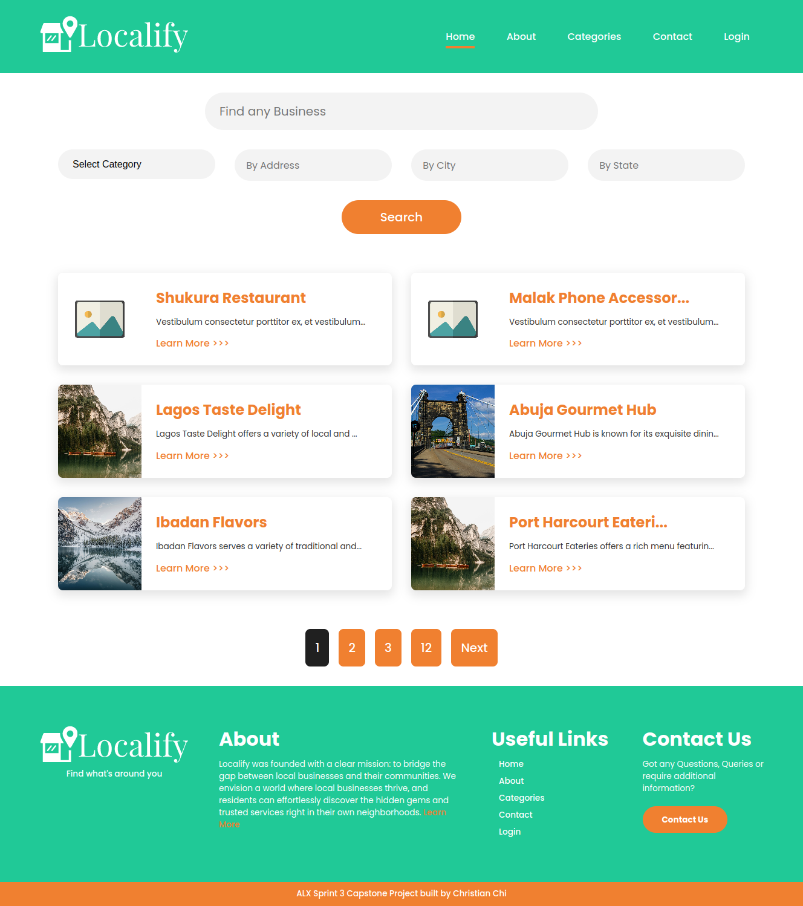
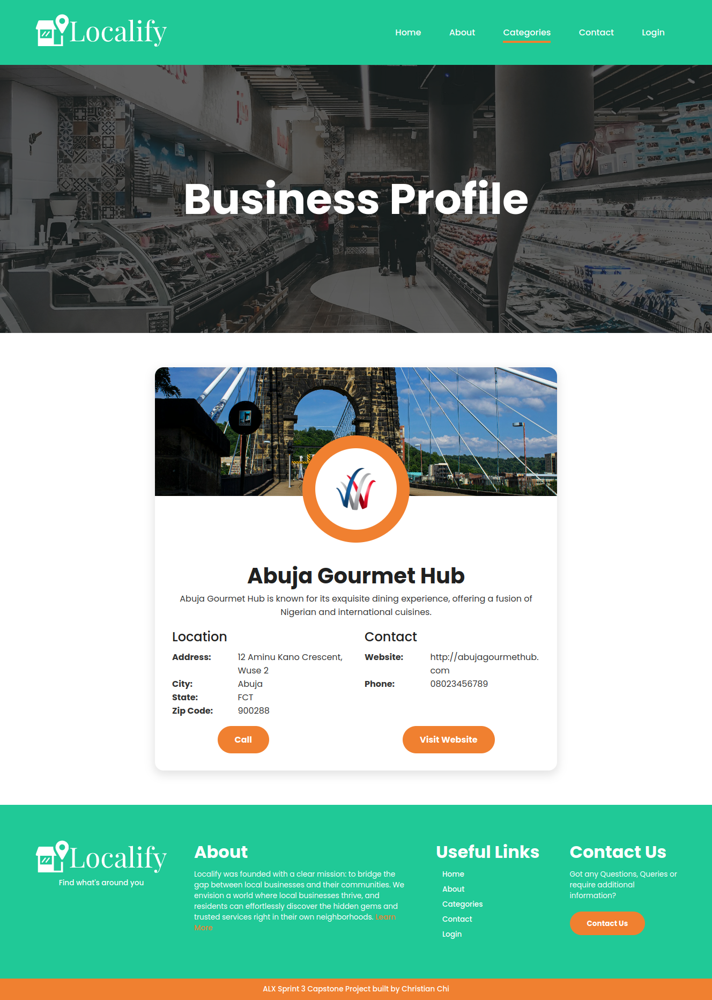
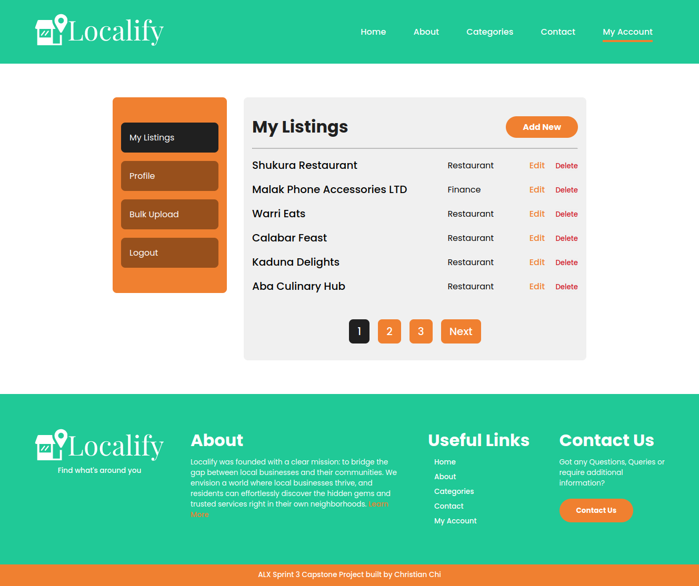
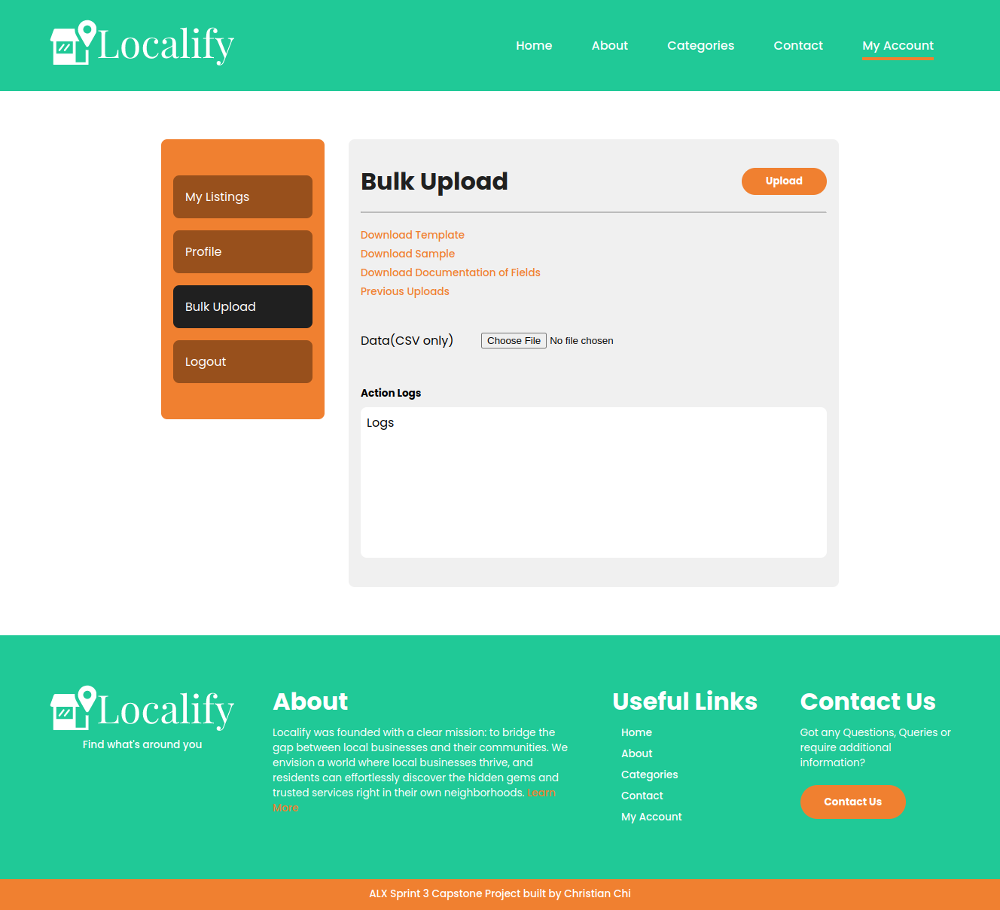

# Localify: Empowering Local Business Discovery

## Introduction

Localify is a web application designed to empower users to effortlessly discover amazing local businesses within their communities. It provides a comprehensive directory with user-friendly search functionalities, detailed business listings, and a focus on fostering a connected local community.

- **Deployed Site:** [Localify Live](https://localify-alx.onrender.com/)
- **Final Project Blog Article:** [Localify Project Blog](https://www.linkedin.com/pulse/localify-empowering-local-business-discovery-christian-chi-o74de)
- **Author LinkedIn:** [Christian Chi](https://www.linkedin.com/in/chrishalogen/)

## Inspiration

Localify was born from a desire to bridge the gap between local businesses and potential customers. The inspiration stemmed from a personal experience navigating a new environment with limited knowledge of local businesses and a language barrier. This frustration highlighted the need for a platform that simplifies local business discovery for residents and newcomers alike.

## Installation

To run Localify locally, follow these steps:

1. **Clone the repository:**

   ```bash
   git clone https://github.com/chrisHalogen/localify-alx.git
   cd localify
   cd project
   ```

2. **Create a virtual environment and activate it:**

   ```bash
   python3 -m venv venv
   source venv/bin/activate
   ```

3. **Install the required packages:**

   ```bash
   pip install -r requirements.txt
   ```

4. **Set Your Database URL:**
   Open the config.py file, set SQLALCHEMY_DATABASE_URI variable with the proper Postgres database url.

5. **Set up the database:**

   ```bash
   flask db init
   flask db migrate -m "Initial migration."
   flask db upgrade
   ```

6. **Run the development server:**
   ```bash
   flask run
   ```

## Usage

1. **Register a new account** or **log in** to an existing account.
2. **Create a new business listing** by providing the necessary details such as name, address, phone number, and category.
3. **Browse listings** to find local businesses based on category or search keywords.
4. **Edit or delete your business listings** as needed.
5. **View your profile** and update your personal information.

## Contributing

We welcome contributions from the community! To contribute to Localify, please follow these steps:

1. Fork the repository.
2. Create a new branch for your feature or bugfix.
3. Commit your changes and push your branch to your fork.
4. Submit a pull request to the main repository.

Please make sure your code adheres to our coding standards and includes appropriate tests.

## Related Projects

- [Yelp](https://www.yelp.com/)
- [Google My Business](https://www.google.com/business/)
- [Yellow Pages](https://www.yellowpages.com/)

## Licensing

Localify is licensed under the MIT License.

## Screenshots





